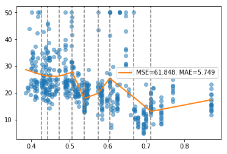
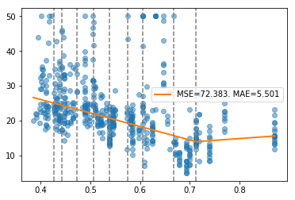
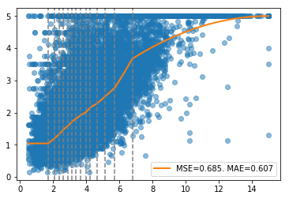

=====
RoPWR
=====

.. image::  https://github.com/guillermo-navas-palencia/ropwr/workflows/CI/badge.svg
   :target: https://github.com/guillermo-navas-palencia/ropwr/workflows/CI/badge.svg

.. image::  https://img.shields.io/github/license/guillermo-navas-palencia/ropwr
   :target: https://img.shields.io/github/license/guillermo-navas-palencia/ropwr
   
.. image:: https://img.shields.io/pypi/v/ropwr?color=blue
   :target: https://img.shields.io/pypi/v/ropwr?color=blue

.. image:: https://pepy.tech/badge/ropwr
   :target: https://pepy.tech/project/ropwr

The **RoPWR** library implements several mathematical programming formulations
to compute the optimal continuous/discontinuous piecewise polynomial regression
given a list of split points. It supports several monotonic constraints, 
objective functions and regularizations. The library is written in Python and
relies on cvxpy (ECOS, OSQP, SCS and HIGHS solvers) to solve the underlying optimization
problems. Other formulations are solved using a direct approach.

.. contents:: **Table of Contents**

Installation
============

To install the current release of ropwr from PyPI:

.. code-block:: text

   pip install ropwr

To install from source, download or clone the git repository

.. code-block:: text

   git clone https://github.com/guillermo-navas-palencia/ropwr.git
   cd ropwr
   python setup.py install

Dependencies
------------
RoPWR requires

* cvxpy (>=1.1.14)
* numpy (>=1.16)
* scikit-learn (>=0.22)
* scipy (>=1.6.1)

Getting started
===============

Please visit the RoPWR documentation (**current** release) http://gnpalencia.org/ropwr/. You can get started following the `tutorials <http://gnpalencia.org/ropwr/tutorials.html>`_ and checking the API reference.

Examples
--------

To get us started, let’s load a well-known dataset from the UCI repository and transform the data into a ``pandas.DataFrame``.

.. code-block:: python

   import pandas as pd
   from sklearn.datasets import load_boston

   data = load_boston()
   df = pd.DataFrame(data.data, columns=data.feature_names)

   x = df["NOX"].values
   y = data.target

To devise split points, we use the implementation of the unsupervised technique equal-size or equal-frequency interval implemented in scikit-learn ``KBinsDiscretizer``.

.. code-block:: python

   from sklearn.preprocessing import KBinsDiscretizer
   from ropwr import RobustPWRegression

   est = KBinsDiscretizer(n_bins=10, strategy="quantile")
   est.fit(x.reshape(-1, 1), y)
   splits = est.bin_edges_[0][1:-1]

If the trend of the relationship with the target is unclear, use the default piecewise regression.

.. code-block:: python

   pw = RobustPWRegression()
   pw.fit(x, y, splits)

Since version 0.4.0 two unsupervised binning techniques, equal-size ("uniform") and equal-frequency interval ("quantile") from scikit-learn KBinsDiscretizer are available using parameters ``splits="quantile"`` or ``splits="uniform"`` and providing the desired number of bins using ``n_bins`` parameter. The previous code is equivalent to

.. code-block:: python

   pw = RobustPWRegression()
   pw.fit(x, y, splits="quantile", n_bins=10)

The relationship with the target exhibits a sort of U-shaped trend. Let's try to force convexity.

.. code-block:: python

   pw = RobustPWRegression(objective="l1", degree=1, monotonic_trend="convex")
   pw.fit(x, y, splits)

To reduce the mean squared error (MSE) and mean absolute error (MAE), we replace convex by valley.

.. code-block:: python

   pw = RobustPWRegression(objective="l1", degree=1, monotonic_trend="valley")
   pw.fit(x, y, splits)

RoPWR supports four objectives functions ("l1", "l2", "huber", "quantile") and the addition of a
regularization term (l1-Lasso or l2-Ridge). Additionally, it permits imposing a lower or upper limit to the prediction. 

.. code-block:: python

   from sklearn.datasets import fetch_california_housing

   data = fetch_california_housing()
   df = pd.DataFrame(data.data, columns=data.feature_names)
   x = df["MedInc"].values
   y = df["target"].values

   est = KBinsDiscretizer(n_bins=15, strategy="quantile")
   est.fit(x.reshape(-1, 1), y)
   splits = est.bin_edges_[0][1:-1]

   pw = RobustPWRegression(objective="huber", monotonic_trend="ascending",
                           degree=2, regularization="l1", verbose=True)
   pw.fit(x, y, splits, lb=1, ub=5)

.. code-block:: text

   ECOS 2.0.7 - (C) embotech GmbH, Zurich Switzerland, 2012-15. Web: www.embotech.com/ECOS

   It     pcost       dcost      gap   pres   dres    k/t    mu     step   sigma     IR    |   BT
    0  +0.000e+00  -3.418e+04  +8e+05  7e-01  5e+00  1e+00  7e+00    ---    ---    2  1  - |  -  - 
    1  -5.445e+03  -1.409e+04  +3e+05  3e-01  8e-02  1e+00  2e+00  0.8351  2e-01   2  1  1 |  0  0
    2  -5.079e+03  -1.370e+04  +3e+05  3e-01  7e-02  1e+00  2e+00  0.1140  9e-01   2  1  2 |  0  0
    3  +1.681e+03  -2.408e+03  +2e+05  2e-01  4e-02  7e-01  1e+00  0.6098  2e-01   2  1  2 |  0  0
    4  +6.977e+03  +5.329e+03  +7e+04  7e-02  2e-02  3e-01  5e-01  0.6562  1e-01   2  1  2 |  0  0
    5  +1.037e+04  +9.826e+03  +2e+04  2e-02  1e-02  9e-02  2e-01  0.7604  1e-01   2  2  2 |  0  0
    6  +1.102e+04  +1.066e+04  +2e+04  1e-02  9e-03  6e-02  1e-01  0.4819  3e-01   2  2  1 |  0  0
    7  +1.202e+04  +1.189e+04  +6e+03  5e-03  5e-03  2e-02  5e-02  0.7116  1e-01   1  2  2 |  0  0
    8  +1.202e+04  +1.189e+04  +6e+03  5e-03  5e-03  2e-02  5e-02  0.0642  9e-01   2  2  1 |  0  0
    9  +1.216e+04  +1.206e+04  +4e+03  4e-03  4e-03  1e-02  3e-02  0.3528  3e-01   2  2  2 |  0  0
   10  +1.216e+04  +1.206e+04  +4e+03  4e-03  4e-03  1e-02  3e-02  0.0043  1e+00   1  2  2 |  0  0
   11  +1.215e+04  +1.206e+04  +4e+03  4e-03  4e-03  1e-02  3e-02  0.1560  9e-01   3  2  2 |  0  0
   12  +1.220e+04  +1.212e+04  +4e+03  3e-03  3e-03  1e-02  3e-02  0.2911  6e-01   2  2  2 |  0  0
   13  +1.219e+04  +1.211e+04  +3e+03  3e-03  3e-03  9e-03  3e-02  0.7226  9e-01   1  1  2 |  0  0
   14  +1.246e+04  +1.242e+04  +1e+03  1e-03  1e-03  4e-03  1e-02  0.5864  3e-02   2  2  1 |  0  0
   15  +1.255e+04  +1.253e+04  +8e+02  7e-04  8e-04  2e-03  7e-03  0.5172  1e-01   2  2  1 |  0  0
   16  +1.261e+04  +1.260e+04  +4e+02  3e-04  4e-04  1e-03  3e-03  0.5858  8e-02   1  1  1 |  0  0
   17  +1.264e+04  +1.264e+04  +1e+02  1e-04  1e-04  3e-04  1e-03  0.9487  3e-01   1  2  2 |  0  0
   18  +1.266e+04  +1.266e+04  +2e+01  1e-05  2e-05  4e-05  1e-04  0.8967  3e-02   1  2  2 |  0  0
   19  +1.266e+04  +1.266e+04  +2e+00  2e-06  2e-06  5e-06  2e-05  0.8827  1e-02   2  1  1 |  0  0
   20  +1.266e+04  +1.266e+04  +6e-01  5e-07  6e-07  1e-06  5e-06  0.9890  3e-01   1  1  1 |  0  0
   21  +1.266e+04  +1.266e+04  +1e-01  9e-08  1e-07  2e-07  8e-07  0.8542  3e-02   2  1  1 |  0  0
   22  +1.266e+04  +1.266e+04  +4e-02  3e-08  4e-08  9e-08  3e-07  0.8281  2e-01   2  1  1 |  0  0
   23  +1.266e+04  +1.266e+04  +2e-02  1e-08  2e-08  4e-08  1e-07  0.7671  2e-01   2  1  1 |  0  0
   24  +1.266e+04  +1.266e+04  +3e-03  2e-09  3e-09  6e-09  2e-08  0.9531  1e-01   2  1  1 |  0  0
   25  +1.266e+04  +1.266e+04  +4e-05  3e-11  4e-11  8e-11  3e-10  0.9862  1e-04   2  1  1 |  0  0

   OPTIMAL (within feastol=3.7e-11, reltol=2.8e-09, abstol=3.5e-05).
   Runtime: 4.340140 seconds.

